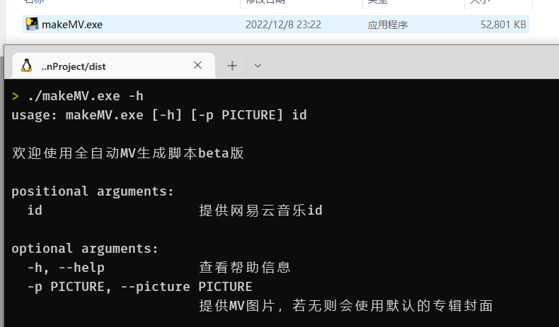

# 全自动MV生成脚本

利用音乐平台的歌与歌词轴，指定图片或使用默认专辑封面生成MV，主要用于纯K投屏。
（因为纯K投网易云音乐时，会没有歌词。。）

MV效果如 [BILI](https://www.bilibili.com/video/BV1wv4y1o7JT)


使用方法参考下图：

直接使用二进制版本 查看release页面


或者源代码


```shell
python makeMV.py -h

python.exe makeMV.py 1971659505

# windows下路径需要注意
python.exe makeMV.py 1971659505 -p F:/Dev/MakeMV/result/test/2-tenka_p_ssr6_f.png

python.exe makeMV.py 1971659505 -p F:/Dev/MakeMV/result/test
```


## requirement

python3, ffmpeg

requests, Pillow

## TODO
代码中备注的TODO为需要优化的点，目前主要功能都实现了，剩下比较多代码重构，异常捕获的事（笑死，我都不相信自己会去优化代码）
- [x] 平移时间轴（歌词提早显示和延迟结束）
- [ ] 获取更高码率的音频、手动指定音频？（似乎没有高码率的api
- [x] 支持多图切换显示
- [x] 打包发行，减少对用户环境需求


## 二进制版本


为了防止生成的包巨大，可以准备一个新的虚拟环境

（蠢方法：可以使用pycharm提供的virtualenv功能新建一个项目，然后把需要的代码、文件拉过去）

（尝试pipenv时遇到了权限问题，无法解决）

```shell
# 新环境中安装项目依赖的包
pip install requests Pillow
# 安装pyinstaller
pip install pyinstaller
# 打包成单个可执行文件
pyinstaller.exe -F --add-data "./ffmpeg/*;./ffmpeg/" --add-data "./ass_template.txt;./ass_template.txt"  makeMV.py
```

将ffmpeg打包的方法参考[stackoverflow](https://stackoverflow.com/questions/56370173/how-to-export-ffmpeg-into-my-python-program)

参考[blog1](https://blog.csdn.net/wuzaishiniuzai/article/details/105895715), [blog2](https://zhuanlan.zhihu.com/p/57674343)


## 其他

与lrc2srt库，未来可能会合并。这里用到了不少之前库里的代码

ass文件名为日文会有问题？