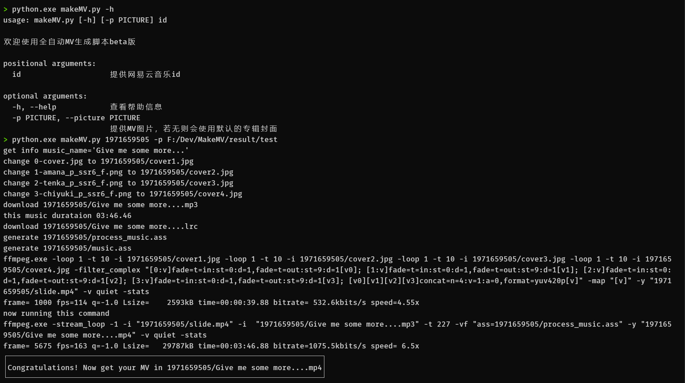
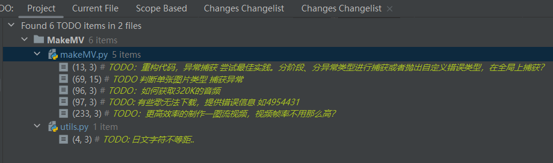

# 全自动MV生成脚本

利用音乐平台的歌与歌词轴，指定图片或使用默认专辑封面生成MV，主要用于纯K投屏。
（因为纯K投网易云音乐时，会没有歌词。。）

使用方法参考下图：


```shell
python makeMV.py -h

python makeMV.py 1971659505

# windows下路径需要注意
python makeMV.py 1988508925 -p F:/Dev/lrc2srt/cover.jpg
```


## requirement

python3, ffmpeg

requests

## TODO
代码中备注的TODO为需要优化的点，主要有以下几点以及未来其他可能做的事
- [ ] 平移时间轴（歌词提早显示和延迟结束）
- [ ] 获取更高码率的音频、手动指定音频？
- [ ] 支持多图切换显示
- [ ] 打包发行，减少对用户环境需求？



## 其他

与lrc2srt库，未来可能会合并。这里用到了不少之前库里的代码

ass文件名为日文会有问题？